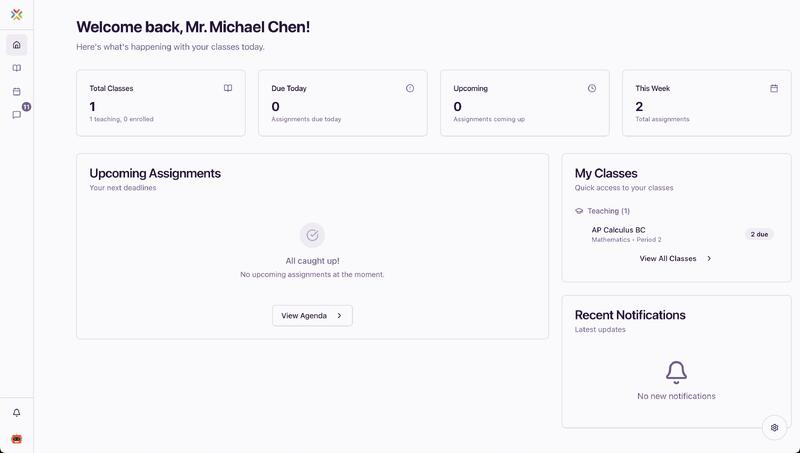
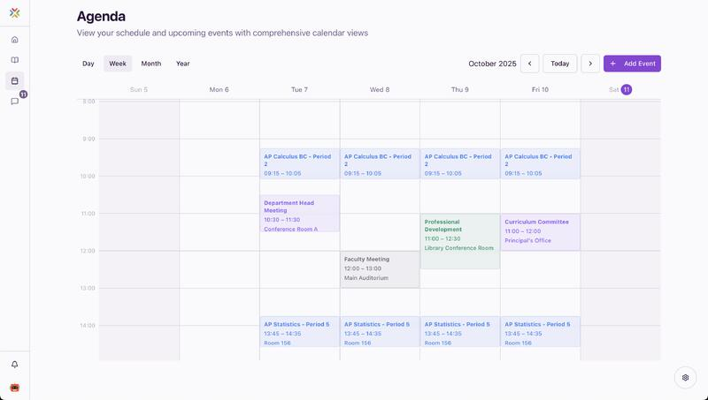
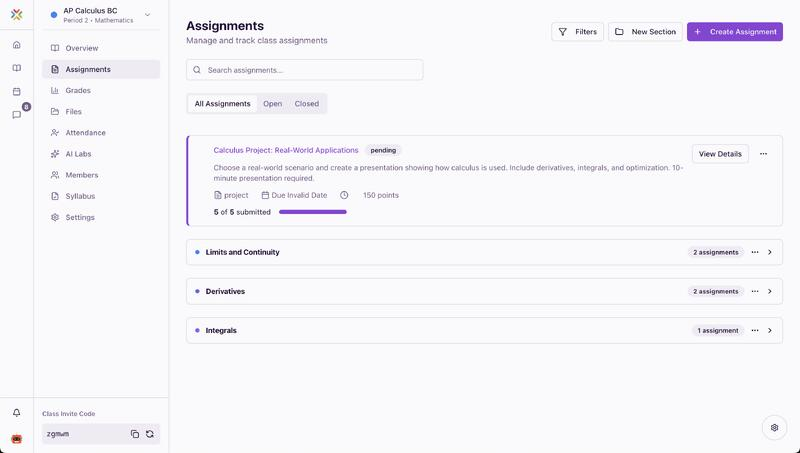
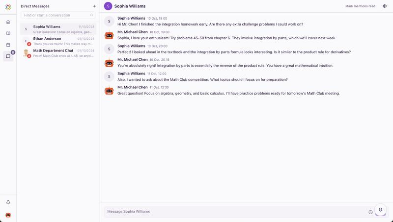
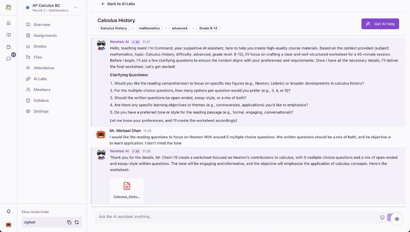

## Video

Watch the short walkthrough: [Studious demo](https://www.youtube.com/watch?v=NXYvrOpZhiU&t=16s)

Studious is a clean, teacher-first workspace for managing classes, assignments, and student communication—plus AI-assisted worksheet creation.
It focuses on the everyday flow of teaching: plan the week, track progress, respond to students, and ship great learning materials without extra tabs or busywork.

Studious is built for:
- Teachers who juggle multiple classes and need clarity at a glance
- Departments that want consistent, high-quality materials
- Schools that care about a calm, accessible interface

## How it works

1. Create or join classes and organize rosters.
2. Add assignments, track submissions, and monitor status.
3. Use the agenda to plan the week and spot conflicts early.
4. Respond to student messages in-context.
5. Generate worksheets with AI to accelerate lesson prep.

## Highlights

- Class and roster management in one place
- Assignment tracking with clear status indicators
- Agenda views for weekly planning
- Direct messaging for quick student support
- AI worksheets to jumpstart lesson prep

## UI previews

### Dark mode

<table>
  <tr>
    <td align="center">
      
       
      High-contrast status cards and class shortcuts.
    </td>
    <td align="center">
      
       
      Organized class tiles with a calm dark palette.
    </td>
  </tr>
  <tr>
    <td align="center">
      
       
      Week view optimized for low-light planning.
    </td>
    <td align="center">
      
       
      Assistant view tuned for long sessions.
    </td>
  </tr>
</table>

### Light mode

<table>
  <tr>
    <td align="center">
      
       
      Quick status cards and class shortcuts at a glance.
    </td>
    <td align="center">
      
       
      Clean list view for teaching and enrolled sections.
    </td>
  </tr>
  <tr>
    <td align="center">
      
       
      Week view that surfaces time blocks and conflicts early.
    </td>
    <td align="center">
      
       
      Clear sections, progress indicators, and due-date control.
    </td>
  </tr>
  <tr>
    <td align="center">
      
       
      Focused conversations with students and groups.
    </td>
    <td align="center">
      
       
      Inline AI assistant for generating worksheets fast.
    </td>
  </tr>
</table>

## Project links

- Contributing guide: `CONTRIBUTING.md`
- Code of conduct: `CODE_OF_CONDUCT.md`
